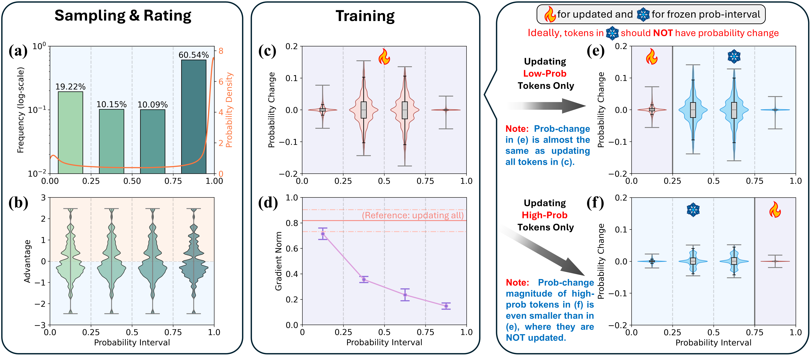
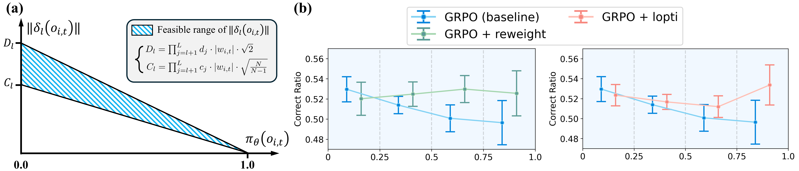
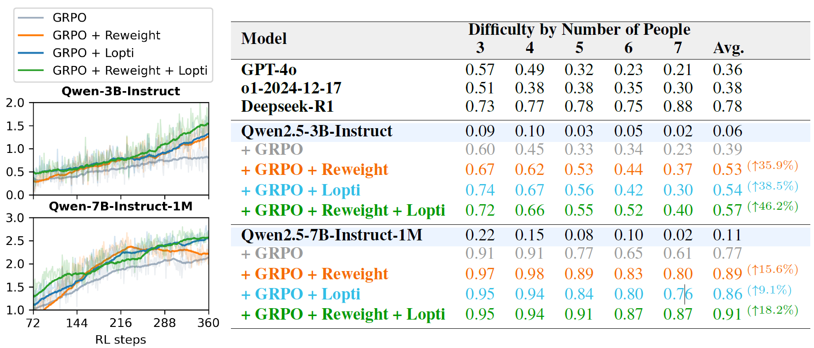

# Do Not Let Low-Probability Tokens Over-Dominate in RL for LLMs

[](https://arxiv.org/abs/2505.12929)

#### Authors: [Zhihe Yang](https://zhyang2226.github.io)$^{1}$, [Xufang Luo](https://www.microsoft.com/en-us/research/people/xufluo/)$^{2*}$, [Zilong Wang](https://www.microsoft.com/en-us/research/people/wangzilong/)$^2$, [Dongqi Han](https://www.microsoft.com/en-us/research/people/dongqihan/)$^2$, [Zhiyuan He](https://www.microsoft.com/en-us/research/people/zhiyuhe/)$^2$, [Dongsheng Li](http://recmind.cn/)$^2$, [Yunjian Xu](https://www4.mae.cuhk.edu.hk/peoples/xu-yunjian/)$^{1*}$, 

($^*$ for corresponding authors)

1. The Chinese University of Hong Kong, Hong Kong SAR, China
2. Microsoft Research Asia, Shanghai, China

## Introduction

In this study, we identify a critical yet underexplored issue in RL training: low-probability tokens disproportionately influence model updates due to their large gradient magnitudes. This dominance hinders the effective learning of high-probability tokens, whose gradients are essential for LLMs' performance but are substantially suppressed.

As presented in the following figure, during GRPO training, tokens are divided into four groups based on probability quartiles. Figure(d) shows that low-probability tokens generate disproportionately larger gradients compared to high-probability ones. Since each RL update involves hundreds of thousands of tokens with interacting gradients, low-probability tokens are expected to have a greater influence. To verify this, we independently update tokens from the lowest and highest quartiles, as shown in Figures(e) and (f). The pattern in (e) closely matches (c), while (f) looks significantly different. Interestingly, in (e), even though high-probability tokens were not updated, their probabilities changed more significantly than when they were updated (as shown in (f)).



We present a concise theoretical explanation for this phenomenon. As illustrated in panel (a) of the following figure, for a LLM composed of a benign neural network, the gradient norm of any intermediate activation corresponding to a single token is bounded between two values that are proportional to $(1 - \pi)$, where $\pi$ represents the probability of the token. 

Besides, we also propose two simple yet effective methods to resolve this problem: **Advantage Reweighting (AR)** and **Low-Probability Token Isolation (Lopti)**. Both methods attenuate gradients from low-probability tokens while emphasizing parameter updates driven by high-probability tokens, thereby enhancing learning efficiency for high-probability tokens (as presented in panel (b)).



Experiments on downstream tasks demonstrate that our methods significantly improve the performance of GRPO/REINFORCE++, achieving up to 46.2% improvement in K&K Logic Puzzle dataset.



## Build Up Environment

Our code has been successfully tested on 4×80GB A100/H100 GPUs with CUDA 12.1. The following commands will create a Conda environment with all the required dependencies:

```bash
  conda create -n AR_Lopti python=3.9
  conda activate AR_Lopti
  pip install torch==2.4.0 --index-url https://download.pytorch.org/whl/cu121
  pip3 install vllm==0.6.3 ray
  pip3 install flash-attn --no-build-isolation
  pip install -e .
  pip install wandb IPython matplotlib
  pip install torchdata==0.8.0
  pip install pylatexenc
  pip install tensordict==0.5.0
```

## Run the Code

After setting up the environment, you can run the code with the following command:

* For GRPO Baseline
  ```bash
    bash scripts/train_kklogic_baseline_4x80GB.sh
  ```
* For GRPO with Advantage Reweighting
  ```bash
    bash scripts/train_kklogic_AR_4x80GB.sh
  ```
* For GRPO with Lopti
  ```bash
    bash scripts/train_kklogic_Lopti_4x80GB.sh
  ```
* For GRPO with Advantage Reweighting + Lopti
  ```bash
    bash scripts/train_kklogic_AR-Lopti_4x80GB.sh
  ```

The models will be continuously evaluated during training, and all experimental records will be automatically logged to the `wandb` platform.

Please note that the model to be trained can be modified in **Lines 4-5** of each bash script. The default setting is `Qwen/Qwen2.5-7B-Instruct-1M`, and another option is `Qwen/Qwen2.5-3B-Instruct`.

Additionally, the baseline algorithm can be adjusted in **Line 22** of each bash script. The default setting is `grpo`, with `reinforce_plus_plus` as an alternative option.

## Acknowledgements
* This repository is built on top of [verl](https://github.com/volcengine/verl). We extend our gratitude to the verl team for open-sourcing such a powerful RL4LLMs framework.
* We also sincerely acknowledge the datasets and corresponding reward function provided by [LogicRL](https://github.com/Unakar/Logic-RL), [DeepScaleR](https://github.com/agentica-project/rllm), [AdaRFT](https://github.com/limenlp/verl), and [ORZ](https://github.com/Open-Reasoner-Zero/Open-Reasoner-Zero).


## Citation
If you find our work useful, please consider citing our paper:

```bibtex
@article{yang2025AR_Lopti,
  title={Do Not Let Low-Probability Tokens Over-Dominate in RL for LLMs}, 
  author={Zhihe Yang and Xufang Luo and Zilong Wang and Dongqi Han and Zhiyuan He and Dongsheng Li and Yunjian Xu},
  year={2025},
  eprint={2505.12929},
  archivePrefix={arXiv},
  url={https://arxiv.org/abs/2505.12929}, 
}
```